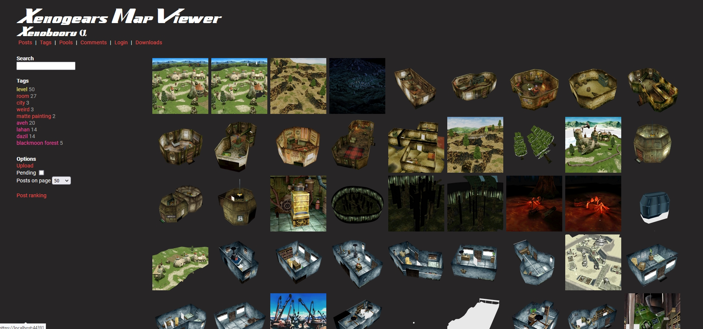
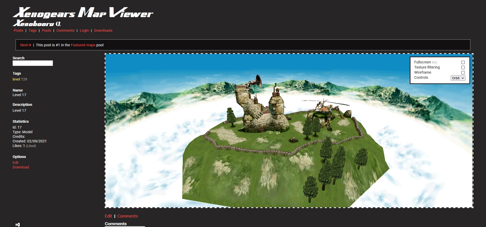

# Xenogears Map Viewer
**aka XenoBooru alpha**

The name is pretty self-explainatory. A website that allaws you to view maps from the 1998 Square jRPG Xenogears in our own browser.

The design is based on -booru sites. Each posts can be tagged, commented or liked. Then posts can be searched based on one or more tags. Posts can be also grouped into more specific pools.

## Hosting
Website is hosted entirely on Azure, including the database and storage where static files like thumbnails or maps themselves are uploaded.

## Pages

### Posts

### Map viewer

